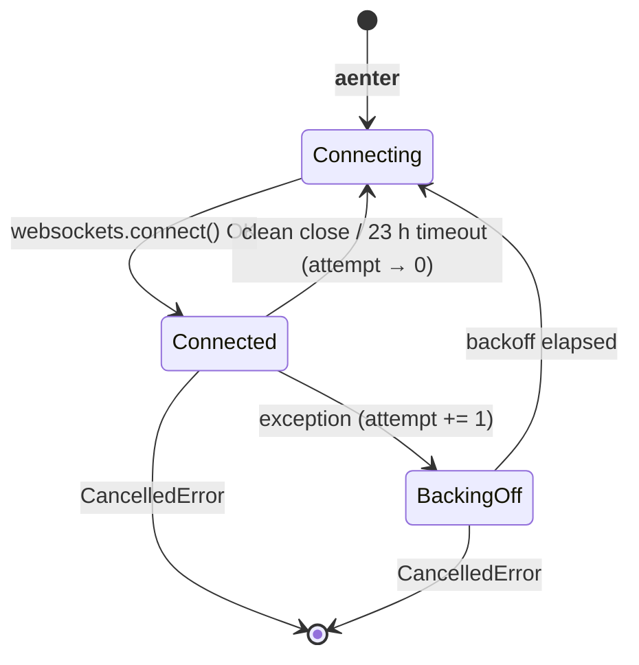

# BinanceWsClient — Architecture & Design Rationale

**Relevant source files:**
- `src/hermes/exchanges/binance_ws.py` — client implementation
- `src/hermes/exchanges/binance_contracts.py` — `WsMetrics`, stream contracts

This document records *why* the client is designed the way it is.
For *how to use it*, see the class docstring in `binance_ws.py`.

---

## 1. Combined-stream vs Raw-stream

Binance offers two WebSocket endpoints:

| Endpoint | URL pattern | Frame format |
|----------|-------------|--------------|
| Raw-stream | `wss://…/ws/<stream>` | Bare JSON event `{"e":"kline","s":"SOLUSDT",...}` |
| Combined-stream | `wss://…/stream?streams=s1/s2/…` | Envelope `{"stream":"solusdt@kline_1m","data":{...}}` |

We use **combined-stream** for two reasons:

1. **Demultiplexing.** With raw-streams, the frame has no stream tag — you
   must open one WebSocket per stream and track identity out-of-band. With
   combined-stream, every frame carries `"stream": "<name>"`, so a single
   dispatcher can route to the right parser without per-connection state.

2. **Connection economy.** One combined-stream connection replaces N raw-stream
   connections. Fewer TCP connections means fewer NAT entries on the Vultr VPS,
   lower firewall state pressure, and fewer TLS handshakes on reconnect.

**Trade-off accepted:** combined-stream adds ~20–30 bytes of envelope overhead
per frame. At typical bookTicker rates (~10 msgs/s per symbol) this is
negligible. We cap at 200 streams per connection (Binance allows 1024) to
leave headroom for the strategy layer to open multiple clients independently.

---

## 2. Reconnect State Machine

Two coroutines cooperate. `_run_one` owns a single TCP connection;
`_run_with_reconnect` supervises it.



**Key invariant:** `attempt` resets to 0 on any *clean* exit from `_run_one`
(server close, or 23 h `asyncio.wait_for` timeout). It only increments on
unexpected exceptions. This ensures that a brief outage followed by recovery
does not accumulate backoff state that slows subsequent clean reconnects.

**Why `wait_for(_run_one(), timeout=23h)` instead of an internal timer?**
`asyncio.wait_for` is a clean cancellation mechanism that avoids threading the
timeout check through every `await` inside `_run_one`. The `TimeoutError` it
raises is caught in `_run_with_reconnect` and treated identically to a clean
server close.

### Backoff formula

```
attempt 1  →  0 s           (immediate retry; transient blips often resolve)
attempt 2  →  ~1 s
attempt 3  →  ~2 s
attempt N  →  min(2^(N-2), 60 s)  ±25% jitter
```

The 60 s cap aligns with most production HFT WS clients: fast enough to
recover from brief maintenance windows, slow enough to avoid hammering
Binance during prolonged outages. Jitter (±25%) prevents reconnect storms
when a Binance maintenance window kicks thousands of clients simultaneously.

---

## 3. Keepalive Design

```python
_WS_PING_INTERVAL = 20   # seconds
_WS_PING_TIMEOUT  = 10   # seconds
```

These values are passed to `websockets.connect()`. The library sends a WebSocket
ping frame every 20 s and closes the connection (raising `ConnectionClosed`) if
no pong is received within 10 s.

**Why not rely on OS TCP keepalive?**
OS keepalive defaults to 2 h on Linux. A NAT timeout or route flap can leave a
socket in a half-open state for up to 2 h without triggering any error.
Application-level keepalive at 20 s surfaces these faults within 30 s
(interval + timeout), triggering `_run_with_reconnect`'s backoff path.

**Why 20 s interval specifically?**
Binance's documentation does not specify a server-side idle timeout. Empirically,
20 s is the conventional value used by Binance client libraries (python-binance,
ccxt). Values much lower (< 10 s) risk being interpreted as abusive on shared
testnet infrastructure.

**What this does NOT cover (see Known Limitations §6.1):**
Application-layer keepalive — verifying that market-data frames are actually
arriving, not just that the TCP socket responds to pings — is absent. A
connection that stays alive at the TCP level but stops delivering market data
would not be detected here.

---

## 4. WsMetrics — Field Semantics

`WsMetrics` is a frozen dataclass snapshot returned by `BinanceWsClient.metrics`.
All timestamp fields use `time.monotonic()` — values are meaningful only within
a single process run.

| Field | Type | Meaning |
|-------|------|---------|
| `messages_received_total` | `int` | Cumulative frame count across all connections and reconnects |
| `messages_by_kind` | `dict[StreamKind, int]` | Per-type breakdown; use to verify expected stream mix |
| `reconnect_count` | `int` | Error-triggered reconnects only; does NOT count clean-close reconnects |
| `current_attempt` | `int` | Backoff attempt counter; 0 = healthy / clean state |
| `last_message_at` | `float \| None` | Monotonic timestamp of last received frame; `None` until first message |
| `connected_since` | `float \| None` | Monotonic timestamp of current connection start; `None` when not connected |
| `total_connect_duration_s` | `float` | Cumulative wall time spent connected across all connection lifetimes |

**Monitoring usage:**

- **Stall detection (not yet implemented):** `time.monotonic() - last_message_at > threshold`
  would detect a silent socket. This check belongs in Phase 3 monitoring
  (watchdog coroutine); the field is instrumented now so the watchdog can
  be wired without touching the client.

- **Health check:** `current_attempt == 0` means the client is in a clean
  connected state. `current_attempt > 0` means it is in a backoff retry cycle.

- **Uptime:** `total_connect_duration_s` accumulates across reconnects, giving
  a process-lifetime connected-time metric independent of reconnect count.

- **Stream mix validation:** `messages_by_kind[StreamKind.UNKNOWN]` should be 0
  in production. A non-zero value indicates unrecognized stream types that need
  a new parser branch.

---

## 5. Queue and Backpressure

The internal `asyncio.Queue(maxsize=10_000)` is created in `__aenter__` (not
`__init__`) so it is bound to the running event loop. This keeps construction
loop-free, which matters for tests that construct `BinanceWsClient` without a
running loop.

`await queue.put(msg)` in `_run_one` blocks when the queue is full. This
applies TCP-level backpressure: if the consumer falls behind, the socket's
receive buffer fills and Binance will eventually see a stalled connection.
10 000 messages is ~minutes of buffer at typical bookTicker rates, giving the
consumer time to recover from a transient processing spike before stalling.

**Alternative considered — unbounded queue:** Rejected. An unbounded queue
would let the consumer fall arbitrarily far behind without any signal, leading
to unbounded memory growth during a processing outage.

---

## 6. Known Limitations

These are documented omissions, not bugs. Each has a planned resolution.

### 6.1 No application-layer stall detection

The keepalive (§3) confirms the TCP connection is alive but does not verify
that market data is actually flowing. A socket that receives pong frames but
no market-data frames (e.g. due to a Binance-side stream pause) would not be
detected. **Resolution:** a watchdog coroutine that checks
`time.monotonic() - metrics.last_message_at > 60 s` and emits a structlog
warning; planned for Phase 3 monitoring.

### 6.2 Fixed stream list

Streams are fixed at construction time. Dynamic subscribe/unsubscribe is not
supported in Phase 2. **Resolution:** to change subscriptions, close the client
and open a new one. The Binance WebSocket API supports `SUBSCRIBE` /
`UNSUBSCRIBE` JSON-RPC messages; adding this is deferred until a concrete use
case requires it.

### 6.3 User-data streams deferred

Binance deprecated the REST `POST /api/v3/userDataStream` (listenKey) endpoint
(HTTP 410 Gone, observed 2026-02-04). User-data streams will be added in Phase 5
using the new `userDataStream.subscribe` WebSocket-API RPC method, when order
execution requires it.

---

## 7. References

**Implementation files**

| File | Purpose |
|------|---------|
| `src/hermes/exchanges/binance_ws.py` | `BinanceWsClient` implementation |
| `src/hermes/exchanges/binance_contracts.py` | `WsMetrics`, `StreamMessage`, stream contracts |
| `tests/unit/exchanges/test_binance_ws.py` | Unit test suite (97 tests) |

**External documentation**

| Resource | URL |
|----------|-----|
| Binance Spot WebSocket Streams | https://developers.binance.com/docs/binance-spot-api-docs/web-socket-streams |
| Binance user-data stream endpoints (deprecated) | https://developers.binance.com/docs/binance-spot-api-docs/rest-api/user-data-stream-endpoints-deprecated |
| websockets Python library | https://websockets.readthedocs.io/en/stable/ |
